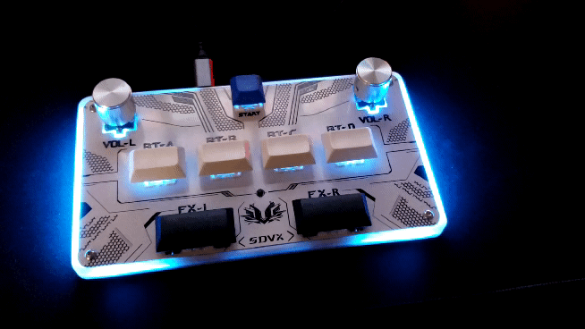

# Pico Game Controller (IIDX-oriented fork)

Firmware for Raspberry Pi Pico (RP2040) that targets rhythm-game controllers. This fork is tuned for IIDX-style builds: 11 buttons, 11 per-button LEDs, 1 WS2812B RGB strip (40 LEDs), and 1 encoder (turntable).

Key features

- USB HID composite: joystick (default), NKRO keyboard + mouse.
- 1000 Hz polling, debounce algorithms, reversible encoder.
- HID-controlled button LEDs with reactive fallback when host stops sending.
- WS2812B RGB runs on core 1 with PIO; effects use a palette system.
- Two HID RGB “zones” for host-driven color accents.

Boot-time controls (hold while powering/resetting)

- Hold SW_GPIO[0] (GPIO 2): start in NKRO keyboard + mouse mode.
- Hold SW_GPIO[1] (GPIO 4): force Turbocharger LED effect.
- Hold SW_GPIO[8] (GPIO 19): disable RGB (don’t launch core 1).

LED effects

- Default: Demo All — cycles through all effects with smooth crossfades.
- Built-in effects include: Turbocharger, Trail, Color Cycle, Dual Orbit, Velocity Comet, Button Ripples, Spokes, Counter Stripes, Palette Tint Gradient, Multipoint Snap, Center Pulse, Sector Equalizer, Radar Sweep.
- HID lights: if no OUT report arrives for 1s, the firmware falls back to button‑reactive LEDs.

Configuration

- All sizes, pins, and constants are in `src/controller_config.h`.
  - Buttons (SW_GPIO), per-button LEDs (LED_GPIO), WS2812B pin, and counts.
  - Encoder PPR and direction (flip `ENC_REV[0]` if your knob is reversed).
  - Debounce timing and reactive timeout.
- Debounce algorithms live in `src/debounce/` (eager and deferred).
- RGB effects live in `src/rgb/`; new effects just write into the global `leds[]` and are rendered by core 1.

Build and flash (VS Code tasks)

- Compile Project: builds to `build/` using Ninja.
- Run Project: flashes the current UF2 to a Pico in BOOTSEL via picotool.
- Clean Build and Flash (Picotool): removes old artifacts, builds, and flashes.
- Artifacts: UF2 at `build/src/Pico_Game_Controller.uf2` and copied to `build_uf2/`.
- PowerShell helper: `flash.ps1` can build, reboot to BOOTSEL, detect `RPI-RP2`, and copy the UF2.

Notes

- The default RGB effect is “Demo All”. To choose a fixed effect, set `ws2812b_mode` in `init()` (see `src/pico_game_controller.c`).
- Two HID RGB color zones are available to effects via `hid_rgb[]`.

Credits and license

- Original project by SpeedyPotato: https://github.com/speedypotato/Pico-Game-Controller/
- Additional contributions and ideas credited throughout the codebase (Turbocharger by 4yn; debounce variant by SushiRemover; encoder tips by KyubiFox; plus many others referenced in source comments).
- This repository retains the original license; see `LICENSE` for details.
